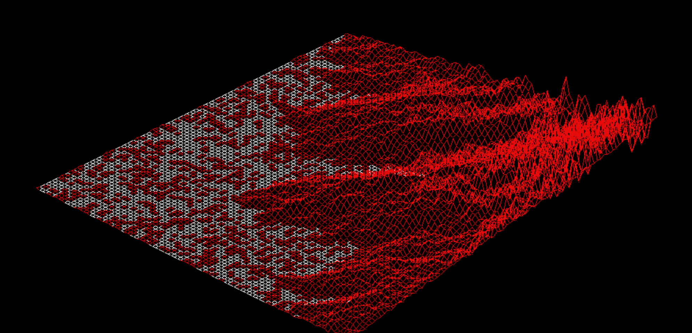

# FDF
<p align="center">
  
</p>

**FdF** ('fil de fer' in French, translating to 'wireframe model'), is a wireframe cartography software. It will represent a landscape as a 3D object where all surfaces are outlined in lines. FdF involves the use of 42's graphical library - **MiniLibX**, which includes the tools necessary to create and destroy windows and images, and deal with input device events (keyboard and mouse actions).

## Grade: 100%

## The Brief:

• Create simple wireframe model representation of a 3D landscape by linking various points (x, y, z)

• Represent model in **isometric projection**

• Coordinates of landscape stored in **\*.fdf** file, passed as a parameter to the program, ie:

<p align="center">
  
</p>

• Each number represents a point in space:
    - Horizontal position: Axis
    - Vertical position: Ordinate
    - Value: Altitude

• Execute fdf program with **42.fdf** map as follows: ``` ./fdf 42.fdf ```
Should render a landscape similar to:
<p align="center">
  
</p>

• Executable: 'fdf'

• Allowed functions: Math library functions, MiniLibX, [libft](https://github.com/NicoleLehmeyer/LIBFT), open(), close(), read(), exit(), malloc(), free()

• Written in C

• Norminette compliant

• No seg fault/bus error/double free etc.


## Run Program:

Create executables: ``` make ```

Run program with chosen map (located in ./maps): ``` ./fdf <maps/*.fdf> ```

ie. ``` ./fdf maps/t2.fdf ```
<p align="center">
  
</p>

---
<p align="center">
Made by NicoleLehmeyer: nlehmeye@student.42adel.org.au | LinkedIn: <a href="https://www.linkedin.com/in/nicole-lehmeyer/">nicole-lehmeyer</a> | Discord: <a href="https://discordapp.com/users/1107446949344448543/">nicole.lehmeyer</a>
</p>

<p align="center">
  
</p>

