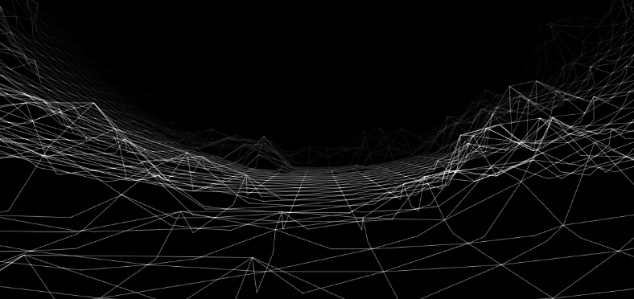
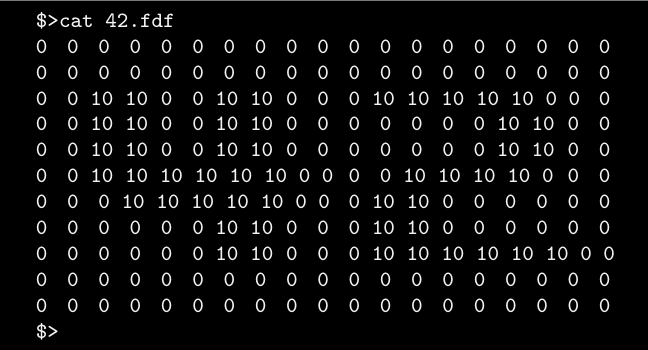
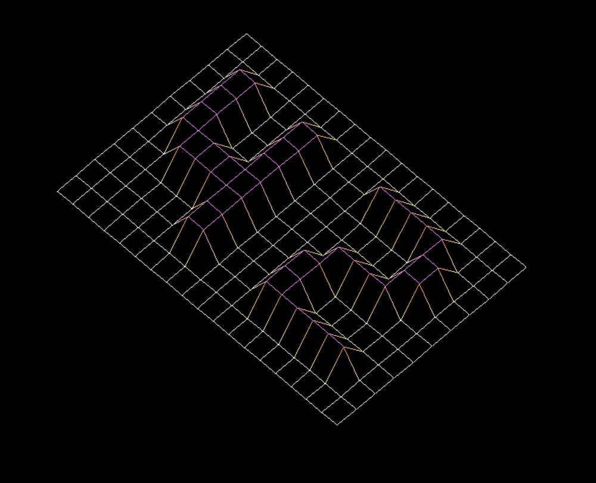

# FDF
<p align="center">
  
</p>


**FdF** ('fil de fer' in French, translating to 'wireframe model'), is a wireframe cartography software. It will represent a landscape as a 3D object where all surfaces are outlined in lines. FdF involves the use of 42's graphical library - **MiniLibX**, which includes the tools necessary to create and destroy windows and images, and deal with input device events (keyboard and mouse actions).

## Grade: 100%

## The Brief:

• Create simple wireframe model representation of a 3D landscape by linking various points (x, y, z)

• Represent model in **isometric projection**

• Coordinates of landscape stored in **\*.fdf** file, passed as a parameter to the program, ie:



• Each number represents a point in space:
    - Horizontal position: Axis
    - Vertical position: Ordinate
    - Value: Altitude

• Execute fdf program with **42.fdf** map as follows:
```
./fdf 42.fdf
```
Should render a landscape similar to:


• Executable: 'fdf'

• Allowed functions: Math library functions, MiniLibX, [libft](https://github.com/NicoleLehmeyer/LIBFT), open(), close(), read(), exit(), malloc(), free()

• Written in C

• Norminette compliant

• No seg fault/bus error/double free etc.


## Run Program:

Create executables:
```
make
```

Run server in one terminal:
```
./server
```

Run client in another terminal:
```
./client <server_PID> <string__to_send>
```
