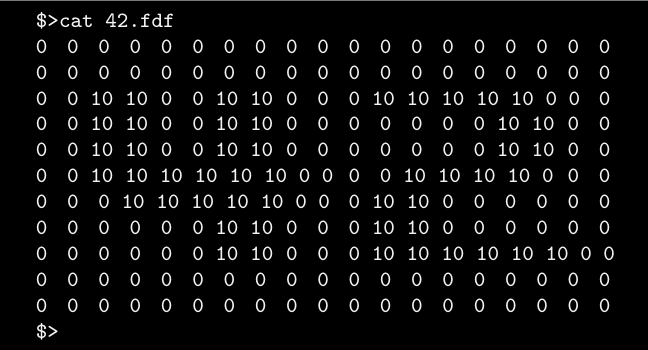
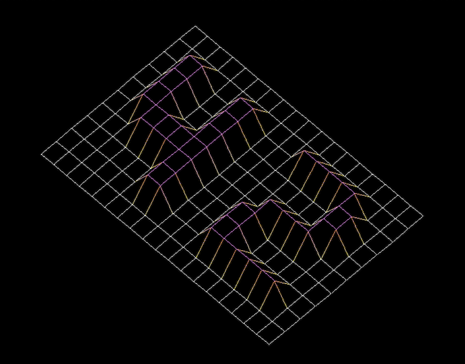
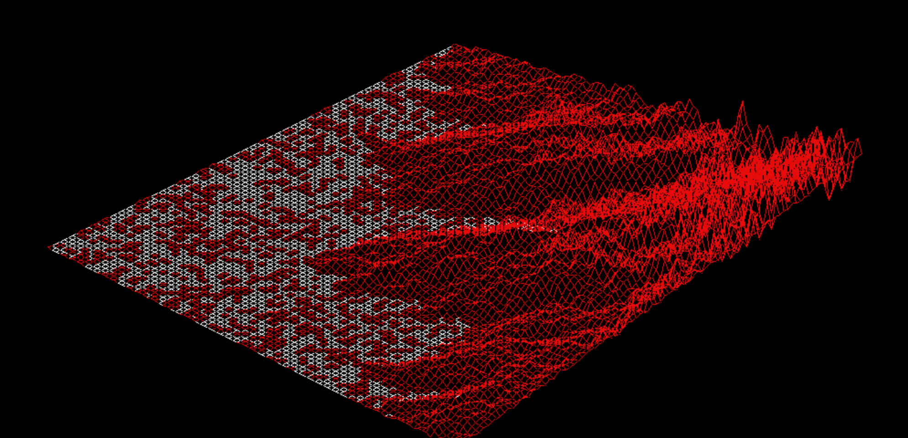

# FDF
<p align="center">
  
</p>
<p>
  <br>
  <b><a href="https://github.com/NicoleLehmeyer/FDF/blob/main/subject/FDF_SUBJECT.pdf">FdF</a> ('fil de fer' in French, translating to 'wireframe model'), is a wireframe cartography software. It will represent a landscape as a 3D object where all surfaces are outlined in lines. FdF involves the use of 42's graphical library - 'MiniLibX', which includes the tools necessary to create and destroy windows and images, and deal with input device events (keyboard and mouse actions).</b><br><br>
  <b>FdF Grade: 100%</b>
  <br>
  <br>
  <br>
  <b>Requirements: </b><br><br>
  Create simple wireframe model representation of a 3D landscape by linking various points (x, y, z).<br><br>
  Represent model in <b>isometric projection</b><br><br>
  Coordinates of landscape stored in <b>*.fdf</b> file, passed as a parameter to the program, ie:<br>
</p>
<p align="center">
    <br><br>
</p>
<p>
  Each number represents a point in space:<br>
    - Horizontal position: Axis<br>
    - Vertical position: Ordinate<br>
    - Value: Altitude<br><br>
  Execute fdf program with <b>42.fdf</b> map as follows: <code>./fdf 42.fdf</code><br>
  <br>
  Should render a landscape similar to:<br>
</p>

<p align="center">
  
</p>
<p>
  Executable: 'fdf'<br><br>
  Allowed functions: Math library functions, MiniLibX, <a href="https://github.com/NicoleLehmeyer/LIBFT">libft</a>, open(), close(), read(), exit(), malloc(), free()<br><br>
  Program must be written in C and <a href="https://github.com/NicoleLehmeyer/LIBFT/blob/main/subject/norme.pdf">Norminette</a> (42 organisational syntax) compliant, without seg fault/bus error/double free etc.<br><br>
  No seg fault/bus error/double free etc.<br><br>
</p>

## Run Program:

Create executables: ``` make ```

Run program with chosen map (located in ./maps): ``` ./fdf <maps/*.fdf> ```

ie. ``` ./fdf maps/t2.fdf ```
<p align="center">
  <br><br>
</p>

---
<p align="center">
Made by NicoleLehmeyer: nlehmeye@student.42adel.org.au | LinkedIn: <a href="https://www.linkedin.com/in/nicole-lehmeyer/">nicole-lehmeyer</a> | Discord: <a href="https://discordapp.com/users/1107446949344448543/">nicole.lehmeyer</a>
</p>

<p align="center">
  
</p>

